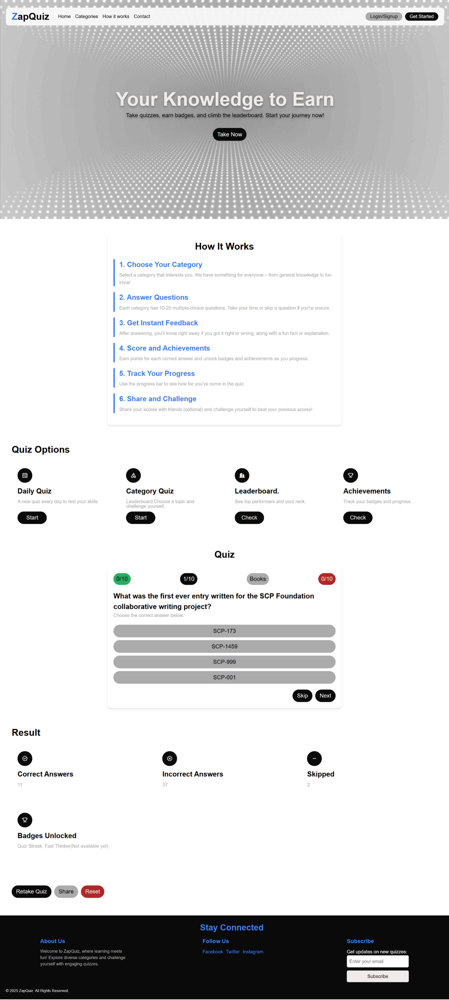

# ZapQuiz

## Description

ZapQuiz is an interactive web-based quiz application designed to test your knowledge and help you earn badges while climbing the leaderboard. It offers a fun and engaging way to challenge yourself with various quiz categories and track your progress.

## Live Demo

You can experience ZapQuiz live here: [Live Demo](https://abhi-zero.github.io/ZapQuiz/)



## Features

*   **Daily Quizzes:** Test your knowledge with a new quiz every day.
*   **Category Quizzes:** Choose from different topics and challenge yourself.
*   **Leaderboard (Coming Soon):** See how you stack up against other players and track top performers.
*   **Achievements (Coming Soon):** Earn badges and unlock achievements as you progress through quizzes.
*   **Instant Feedback:** Get immediate results after answering each question, often accompanied by fun facts or explanations.
*   **Progress Tracking:** Monitor your performance with a real-time progress bar.
*   **User-Friendly Interface:** A clean and intuitive design for a seamless quizzing experience.

## Installation

To get started with ZapQuiz, clone the repository to your local machine:

```bash
git clone https://github.com/your-username/ZapQuiz.git
cd ZapQuiz
```

No additional server-side installation or dependencies are required as this is a front-end application.

## Usage

To use ZapQuiz, simply open the `index.html` file in your preferred web browser.

1.  **Open `index.html`:** Navigate to the `ZapQuiz` directory and open `index.html` in your web browser (e.g., by double-clicking the file).
2.  **Explore Categories:** Head to the "Categories" section to choose your preferred quiz topic.
3.  **Take a Quiz:** Select a quiz type (Daily Quiz or Category Quiz) and start answering questions.
4.  **Track Progress:** Keep an eye on your score.
5.  **Check Results:** View your performance, including correct answers, incorrect answers, and skipped questions, on the results page.
6.  **View Leaderboard & Achievements (Coming Soon):** See your rank and unlocked badges.

## Contributing

Contributions are welcome! If you'd like to improve ZapQuiz, please follow these steps:

1.  Fork the repository.
2.  Create a new branch (`git checkout -b feature/AmazingFeature`).
3.  Make your changes and commit them (`git commit -m 'Add some AmazingFeature'`).
4.  Push to the branch (`git push origin feature/AmazingFeature`).
5.  Open a Pull Request.

For major changes, please open an issue first to discuss what you would like to change.

## License

This project is licensed under the [MIT License](LICENSE). 